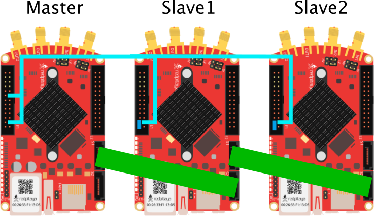

# Cluster

The RedPitayaDAQServer allows to use multiple RedPitayas in a fully synchronized fashion. One of the RedPitayas will act as the master and distribute its clock to all other RedPitayas acting as slaves.

## Prerequisites

Unfortunately, the STEMlab 125-4 does not allow cluster synchronization without hardware modifications. It is therefore necessary to resolder all slaves according to [this](https://redpitaya.readthedocs.io/en/latest/developerGuide/hardware/GEN1/125-14/top.html#external-adc-clock) documentation. The required mode for this project is 'Directly from FPGA' which requires resistors on R27 and R28. The heatsink has to be removed temporarily in order to unsolder the two resistor below it. In the following image you can see the new position of the 0 Ohm 0402 resistors. Since they get lost easily, make sure you have some in stock.

## Connections

To run a cluster of RedPitayas one needs to connect the devices using different cables. An exemplary cluster with 3 devices is shown in the following image.

The clock is distributed from the master to the first slave via an SATA cable (green). Additional slaves can be used by connecting the next slave to the previous one. Additionally all slaves have connection from +3.3 Volt to `DIO0_N`.

In order to send a mutual trigger signal for starting the acquisition and the signal generation, you also have to connect the master's `DIO5_P` pin with the `DIO0_P` pin of all devices including the master.
