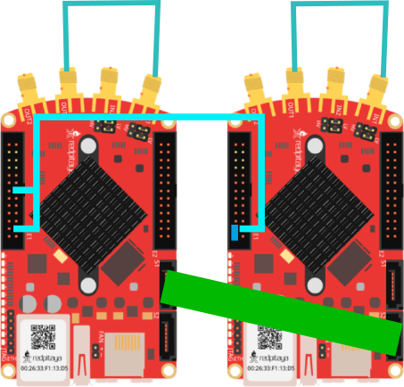

# Cluster Example

In this example we generate and acquire sine waves, similar to to the first [example](simple.md). However, this time we use two RedPitayas sychronized in a cluster. The example will create a sine wave on the first DAC channel of the first RedPitaya and a phase shifted sine wave on the first channel of the second RedPitaya. To run this example connect the RedPitayas in the following way:



Note that while the example only plots the first channel of the RedPitaya, both channels are transmitted to the clients.

## Julia Client

This and all other examples are located in the ```examples``` [directory](https://github.com/tknopp/RedPitayaDAQServer/tree/master/src/examples/julia)

````@eval
# Adapted from https://github.com/JuliaDocs/Documenter.jl/issues/499
using Markdown
Markdown.parse("""
```julia
$(open(f->read(f, String), "../../../src/examples/julia/cluster.jl"))
```
""")
````