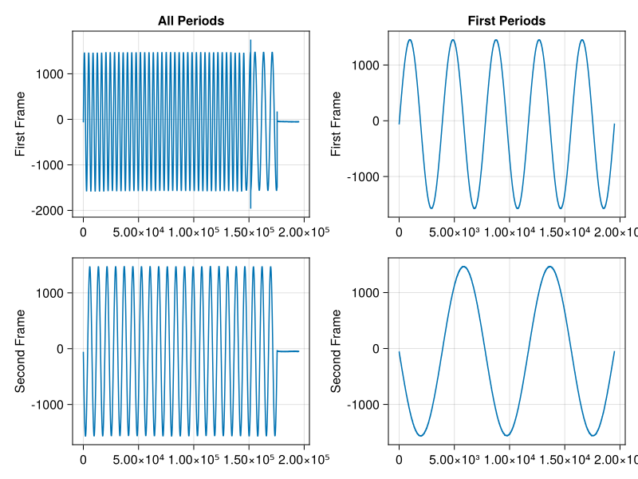

# Resync Example

In this example we add a resync signal to a [sequence](sequence.md) to create a signal that resynchronizes phase and frequency of the DACs after every frame. This can be used to change the frequency and phase of a signal during measurement. While the resynchronization is synchronous due to the sequences, the actual new frequency and phase information is asynchronous as they are transmitted via SCPI.

The example constructs a sequence with no offset and the very last step has the resync flag enabled. Note that during the resync-step the DAC outputs zero.

## Julia Client

This and all other examples are located in the ```examples``` [directory](https://github.com/tknopp/RedPitayaDAQServer/tree/master/src/examples/julia)

````@eval
# Adapted from https://github.com/JuliaDocs/Documenter.jl/issues/499
using Markdown
Markdown.parse("""
```julia
$(open(f->read(f, String), "../../../src/examples/julia/resync.jl"))
```
""")
````


