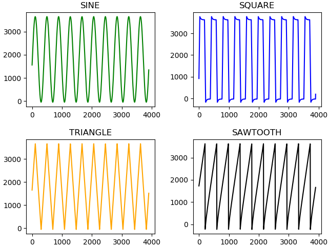

# Simple Example

In this example we generate different signals with a base frequency of 10 kHz on fast DAC
channel 1 and receive the same signals on the fast ADC. To run this example connect
the RedPitaya in the following way.


## Julia Client

This and all other examples are located in the ```examples``` [directory](https://github.com/tknopp/RedPitayaDAQServer/tree/master/src/examples/julia)

````@eval
# Adapted from https://github.com/JuliaDocs/Documenter.jl/issues/499
using Markdown
Markdown.parse("""
```julia
$(open(f->read(f, String), "../../../src/examples/julia/waveforms.jl"))
```
""")
````


